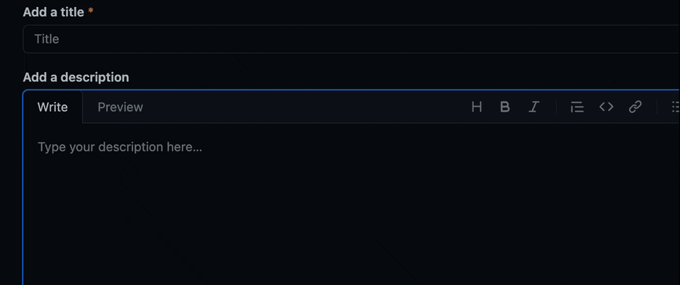

<p align="center">
  
</p>

# GitHub HEIC to JPEG Converter

A Chrome extension that solves the problem of uploading images saved by clipboard management apps like [Paste.app](https://pasteapp.io/) on macOS to GitHub Issues and Pull Requests, which fail because they are in HEIC format.



## Background

Since macOS Sequoia, images saved by Paste.app are stored in HEIC (High Efficiency Image Container) format. However, GitHub does not support HEIC image uploads, resulting in the following error:

> We don't support that file type. Try again with a GIF, JPEG, JPG, MOV, MP4, PNG, SVG, WEBM, CSV, TSV, PDF, TXT, ZIP, GZ, or LOG.

This extension automatically converts HEIC files to JPEG format when pasted or dropped, allowing them to be uploaded to GitHub.

## Features

- Works on GitHub.com Issues, Pull Requests, Discussions, Gists, and more
- Supports both paste (Ctrl+V / Cmd+V) and drag & drop
- Shows a placeholder like `` during conversion
- Automatically replaces with Markdown image link after conversion
- Supports multiple simultaneous image conversions

## Installation

1. Clone the repository
   ```bash
   git clone https://github.com/kazumanagano/github-heic-to-jpeg-extension.git
   cd github-heic-to-jpeg-extension
   ```

2. Install dependencies
   ```bash
   pnpm install
   ```

3. Build
   ```bash
   pnpm build
   ```

4. Load the extension in Chrome
   - Open `chrome://extensions/`
   - Enable "Developer mode"
   - Click "Load unpacked"
   - Select the `dist` folder

## Usage

No special configuration required after installation.

1. Copy an HEIC image from Paste.app or similar
2. Paste into a GitHub Issue or PR comment field
3. The image is automatically converted to JPEG and uploaded

A placeholder is displayed in the textarea during conversion, which is replaced with a Markdown image link upon completion.

## Development

### Requirements

- Node.js 20+
- pnpm

### Commands

```bash
# Start development server (hot reload)
pnpm dev

# Production build
pnpm build

# Unit tests
pnpm test:unit

# E2E tests
pnpm test:e2e

# Run all tests
pnpm test
```

### Project Structure

```
src/
├── content.js      # Content Script (runs on GitHub)
├── background.js   # Service Worker
├── sandbox.js      # HEIC to JPEG conversion (sandboxed)
├── offscreen.js    # Offscreen Document
└── db.js           # IndexedDB operations
```

## Technical Details

### Why Sandbox is Required

HEIC to JPEG conversion uses the [heic2any](https://github.com/alexcorvi/heic2any) library. This library internally uses WebAssembly (libheif), and runs inside a sandboxed iframe to bypass Chrome extension Content Security Policy (CSP) restrictions.

### Conversion Flow

1. Content Script: Detects paste/drop events
2. Background Script: Creates Offscreen Document
3. Offscreen Document: Communicates with Sandbox iframe
4. Sandbox: Converts HEIC to JPEG using heic2any
5. Returns conversion result to Content Script
6. Executes GitHub's standard upload process

## License

MIT

## Related Links

- [Paste.app](https://pasteapp.io/) - Clipboard manager for macOS
- [heic2any](https://github.com/alexcorvi/heic2any) - HEIC conversion library
- [GitHub - Supported file types](https://docs.github.com/en/get-started/writing-on-github/working-with-advanced-formatting/attaching-files)
